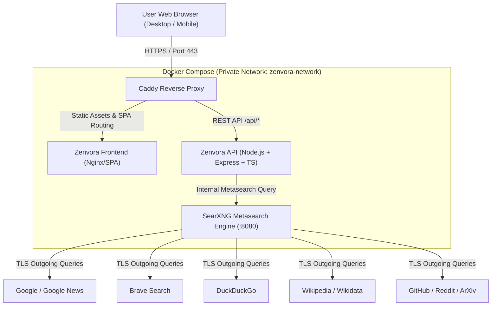

# Zenvora

### **Private. Open. Search.**

A modern, production-grade metasearch engine engineered for zero-tracking discovery.

[](https://github.com/soumya100/zenvora/actions)
[](https://opensource.org/licenses/MIT)
[](https://www.typescriptlang.org/)
[](https://react.dev/)
[](https://www.docker.com/)
[](https://caddyserver.com/)

[**Live Demo**](https://zenvora.example) • [**Documentation**](./docs) • [**Deployment Guide**](./docs/deployment.md) • [**Architecture**](./docs/architecture.md)

</div>

---

## 🌟 Overview

**Zenvora** is an independent, privacy-focused metasearch web application built to deliver an elegant, blisteringly fast search experience without compromising user privacy.

Unlike ad-driven search engines that log your queries to build commercial profiles, Zenvora decouples user requests through an isolated backend and proxies them through **SearXNG**. The application presents an original, refined visual identity with deep navy/charcoal tones, subtle electric cyan accents, rich keyboard navigation, and responsive layouts across desktop and mobile.

> **Privacy Guarantee:** *Zenvora is designed to minimize tracking and does not maintain a personal search history.*

---

## 🚀 Key Features

- 🛡️ **Zero Tracking & No Search History:** Queries exist in volatile memory only for the duration of the search request. Zero queries are logged or stored.
- ⚡ **High-Speed Metasearch Aggregation:** Simultaneously queries Google, Bing, Brave, DuckDuckGo, Wikipedia, Reddit, GitHub, and ArXiv.
- 🎨 **Original Visual Identity:** Clean dark and light modes, soft glowing borders, glassmorphism panels, and modern typography—not a clone of Google.
- 🔍 **Multi-Category Discovery:** Instant tabbed filtering for **All (Web)**, **News**, **Images** (with lightbox preview), **Videos** (with duration badges), **Science**, and **IT / Code**.
- 🧠 **Instant Knowledge Panel:** Embedded Wikipedia knowledge cards for technical concepts and summary definitions.
- ⌨️ **Keyboard First UX:** Global hotkeys (`/` to search, `Esc` to clear, `↑`/`↓` to navigate autocomplete suggestions, `t` to toggle dark/light theme, `?` for shortcuts).
- ⚙️ **Client-Side Preference Persistence:** SafeSearch filters, languages, regions, and tab behaviors persist locally in browser `localStorage`. No accounts required.
- 🔒 **Hardened Security & Isolation:** Internal SearXNG and backend ports are never exposed to the public Internet. Edge reverse proxying and automatic HTTPS managed by Caddy.
- 📦 **1-Command Docker Deployment:** Portable to any generic Linux VPS (Ubuntu 24.04 LTS, Hetzner, DigitalOcean, AWS, GCP) with zero cloud vendor lock-in.

---

## 📐 System Architecture



---

## 🛠️ Technology Stack

| Layer | Technology | Purpose |
|-------|------------|---------|
| **Frontend** | React 18, TypeScript, Vite, Tailwind CSS, Lucide Icons | Responsive SPA, custom design system, accessibility |
| **Backend API** | Node.js 22 LTS, Express, TypeScript, Zod, Helmet | Validation, rate limiting, error shielding, response normalization |
| **Metasearch** | SearXNG (Docker image `searxng/searxng`) | Aggregation, image proxying, multi-engine querying |
| **Reverse Proxy** | Caddy 2 (Alpine) | Automatic TLS (Let's Encrypt / ZeroSSL), HTTP/3, security headers |
| **Orchestration** | Docker Compose | Multi-container isolation, health checks, bridge networking |
| **Testing** | Vitest, Supertest, React Testing Library | API contract tests, query validation tests, UI component tests |
| **CI/CD** | GitHub Actions | Automated linting, test suites, and Docker validation |

---

## ⚡ Quickstart: Local Development

### Option A: 1-Step Docker Compose (Recommended)

Make sure you have [Docker](https://docs.docker.com/get-docker/) installed.

```bash
# 1. Clone repository
git clone https://github.com/your-username/zenvora.git
cd zenvora

# 2. Configure environment
cp .env.example .env

# 3. Start complete stack
docker compose up -d
```

Access Zenvora in your browser:
- **Web Interface:** [http://localhost](http://localhost)
- **Health Probe:** [http://localhost/health](http://localhost/health)

---

### Option B: Native Node.js Development

Run the frontend and backend natively on your local machine with hot reload:

#### 1. Start the Backend API
```bash
cd backend
npm install
npm run dev
```
Backend API will listen on `http://localhost:3000`.

#### 2. Start the Frontend Application
```bash
cd ../frontend
npm install
npm run dev
```
Open [http://localhost:5173](http://localhost:5173) in your browser.

> [!NOTE]
> When running natively without SearXNG, Zenvora's backend automatically activates its built-in fallback mock provider, allowing full UI, testing, and navigation workflows without needing external Docker services!

---

## 🧪 Testing and Quality Checks

```bash
# Run backend validation and tests
cd backend
npm run lint
npm test

# Run frontend tests and production bundle verification
cd ../frontend
npm run lint
npm test
npm run build
```

---

## 🌐 Production VPS Deployment

Zenvora is designed for zero-vendor-lock-in portability across any standard Linux VPS (Ubuntu 24.04 LTS).

For complete step-by-step instructions including non-root user setup, SSH hardening, UFW firewall rules, DNS setup, and Caddy automatic HTTPS, see:

📖 **[Full Production Deployment Guide](./docs/deployment.md)**

---

## ⚙️ Configuration Reference (`.env`)

| Variable | Default | Description |
|----------|---------|-------------|
| `NODE_ENV` | `production` | Execution environment (`production`, `development`, `test`) |
| `PORT` | `3000` | Internal backend port |
| `HOST` | `0.0.0.0` | Backend bind address |
| `SEARXNG_URL` | `http://searxng:8080` | URL of upstream SearXNG container |
| `SEARXNG_SECRET` | *(Random hex)* | 32-char secret token for SearXNG |
| `DOMAIN` | `localhost` | Domain name for Caddy automatic TLS |
| `CORS_ORIGIN` | `*` | Allowed CORS origins for API requests |
| `RATE_LIMIT_MAX` | `60` | Max search requests per minute per IP |
| `MOCK_SEARCH` | `false` | Enable mock search provider for offline/demo testing |

---

## 🔒 Security & Privacy Model

- **Least Privilege:** Internal backend and frontend containers run as unprivileged users (`node` / `nginx`).
- **Network Isolation:** Ports 3000 and 8080 are NOT mapped to the public Internet; Caddy is the only entry point.
- **Image Proxying:** SearXNG proxies image previews to prevent client IP leakage to third-party image hosts.
- **Stripped Telemetry:** URL query parameters (`utm_*`, `fbclid`, `gclid`) are stripped before results are displayed.
- **Strict Headers:** Automatic HSTS (`max-age=31536000`), CSP, `X-Frame-Options: DENY`, and `Referrer-Policy: strict-origin-when-cross-origin`.

For detailed architecture and threat modeling, see **[Architecture Docs](./docs/architecture.md)** and **[Privacy Docs](./docs/privacy.md)**.

---

## 🤝 Attribution & Open Source

- Core metasearch capabilities powered by the open-source **[SearXNG Project](https://github.com/searxng/searxng)**.
- UI, custom API abstraction, caching layer, security policies, and Docker orchestration developed for **Zenvora**.

---

## 📄 License

This project is licensed under the terms of the **[MIT License](LICENSE)**.
