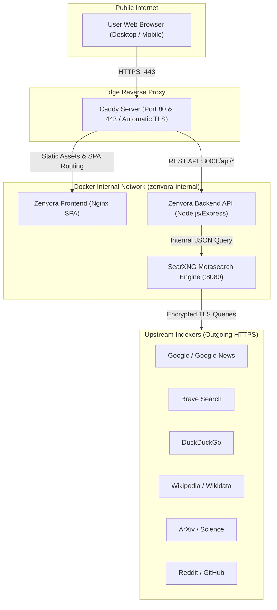

# Zenvora System Architecture & Security Design

This document details the high-level architecture, network isolation model, privacy pipeline, and threat model of **Zenvora**.

---

## 1. High-Level Architectural Topology



---

## 2. Component Breakdown

### 2.1 Caddy Edge Reverse Proxy
- **Role:** Single point of entry from the public Internet.
- **TLS Termination:** Automatically provisions, renews, and manages certificates via Let's Encrypt / ZeroSSL with ACME challenge.
- **Protocols:** Supports HTTP/1.1, HTTP/2, and HTTP/3 (QUIC over UDP).
- **Security Headers:**
  - `Strict-Transport-Security: max-age=31536000; includeSubDomains; preload`
  - `X-Frame-Options: DENY` (prevents UI clickjacking attacks)
  - `X-Content-Type-Options: nosniff` (stops MIME sniffing)
  - `Referrer-Policy: strict-origin-when-cross-origin` (prevents search query leakage to outbound link clicks)
  - `Permissions-Policy: camera=(), microphone=(), geolocation=()` (disables browser surveillance APIs)
  - Content Security Policy (CSP) enforcement.

### 2.2 Zenvora Frontend
- **Stack:** React 18, TypeScript, Vite, Tailwind CSS.
- **Runtime:** Built as an optimized, compressed static bundle and served using an unprivileged Alpine Nginx web server.
- **Zero Client-Side Tracking:** No external analytics scripts (Google Analytics, Mixpanel, Meta Pixel) exist in the codebase.
- **Local Storage Isolation:** User preferences (theme, safeSearch, language, tab behavior) are stored exclusively in the browser's `localStorage` and are never synced to a backend user account.

### 2.3 Zenvora Backend API
- **Stack:** Node.js 22 LTS, Express, TypeScript, Zod, Helmet.
- **Input Sanitization:** Every query parameter is validated against strict Zod schemas (length limits, type checking, safe range boundaries).
- **Rate Limiting:** Built-in IP rate limiter (`express-rate-limit`) preventing scraping and automated abuse (default: 60 requests/minute).
- **In-Memory Cache:** Implements a volatile LRU cache with a 60-second TTL. Duplicate queries are served instantly from memory without contacting upstream engines repeatedly.
- **Error Shielding:** Custom error middleware catches upstream failures and returns sanitized JSON error codes. Internal stack traces, container IPs, and filesystem paths are never leaked.

### 2.4 SearXNG Metasearch Engine
- **Role:** Aggregates search results from multiple external search engines without sending individual user identifiers.
- **Network Isolation:** Runs on a private bridge network without exposed ports on the host.
- **Image Proxy:** Enables proxying for image thumbnails so users do not connect directly to third-party image hosts when viewing search previews.
- **Disabled Telemetry:** All internal metrics, donations, and pingbacks are turned off.

---

## 3. Data Flow and Privacy Pipeline

```
1. Browser  ──[ HTTPS GET /api/search?q=query ]──► Caddy
2. Caddy    ──[ Proxies request to backend:3000 ]─► Zenvora API
3. Backend  ──[ Validates, checks LRU cache ]──────► (Cache Hit? Return immediately)
4. Backend  ──[ GET /search?format=json ]──────────► SearXNG (Internal :8080)
5. SearXNG  ──[ Dispatches parallel TLS queries ]──► External Engines (Google/Brave/DDG)
6. Engines  ──[ Return raw search results ]────────► SearXNG
7. SearXNG  ──[ Aggregates and scores results ]────► Zenvora API
8. Backend  ──[ Strips tracking params & normalizes]► Caddy ──► Browser
```

---

## 4. Threat Model & Defense Mechanisms

| Threat | Risk Level | Mitigation in Zenvora |
|--------|------------|-----------------------|
| **Search History Leakage** | Critical | No database or disk storage for queries exists. Data lives only in transient RAM. |
| **Direct IP Harvesting** | Critical | Server-side proxying decouples the client IP from upstream engines. |
| **Port Exposure & Scanners** | High | Only Caddy (80/443) is exposed in Docker Compose. SearXNG and Backend ports are internal only. |
| **Denial of Service / Scraping** | High | Express rate limiter limits excessive requests per IP; Caddy limits request rates. |
| **Clickjacking & XSS** | Medium | `X-Frame-Options: DENY`, strict CSP, and sanitized HTML output. |
| **Tracking Link Telemetry** | Medium | Automated cleaning of UTM and tracking parameters on all external links. |
